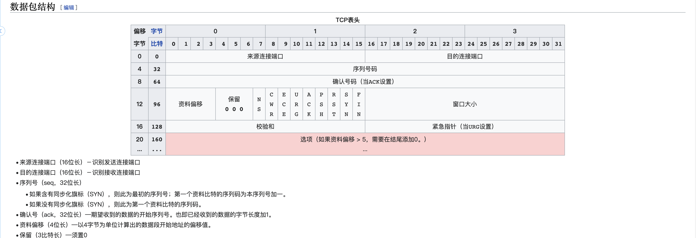

# 1.8 网络协议概要
## 网络分层  

| OSI中的层 | 功能 | TCP/IP协议族 |
| -------- | --- | ----------- |
| 应用层 | 文件传输，电子邮件，文件服务，虚拟终端 | TFTP，HTTP，SNMP，FTP，SMTP，DNS，Telnet | 
| 表示层 | 数据格式化，代码转换，数据加密 | 没有协议 | 
| 会话层 | 解除或建立与别的接点的联系 | 没有协议 | 
| 传输层 | 提供端对端的接口 | TCP，UDP |
| 网络层 | 为数据包选择路由 | IP，ICMP，RIP，OSPF，BGP，IGMP | 
| 数据链路层 | 传输有地址的帧以及错误检测功能 | SLIP，CSLIP，PPP，ARP，RARP，MTU | 
| 物理层 | 以二进制数据形式在物理媒体上传输数据 | ISO2110,IEEE802,IEEE802.2 | 

## 网络协议介绍  
### 应用层  
#### HTTP 
#### SNMP 
#### FTP 
#### Telnet 

## 传输层
#### TCP(传输控制协议)   

TCP协议结构: 
 

数据包样例:  
  

#### UDP(用户数据报协议)   

UDP协议应用及结构:  

数据包样例:  
  

## 数据链路层
#### ARP 

#### MTU 

## 工业协议 

| 总线名称 | 技术特点 | 主要应用场合 | 技术支持的公司 | 
| ------- | ------- | --------- | ---------- | 
| FF | 功能强大，实时性好，总线供电：但协议复杂，实际应用少 | 流程控制、工业过程控制、化工{如防爆环境） | Honeywell. ABB. Foxboro（ 已被施耐德收购）艾默生、ConCab等| 
| HART | 兼有惯拟仪表性能和数字通信性能；允许问答式及成组通信方式 | 现场仪表 | 西门子， ROCKSENSOR 艾默生、福禄克 伊顿公司、横河等 | 
| CAN | 采用短锁，抗干扰能力强；但速度较慢 | 汽车检測、控制 | Siemens. BOSCH、贝加菜（已被ABB收购）Philips. Honeywell. 研华科技等 | 
| LONWORKS | 支持OSI七层协议，实际应用较多 | 楼宇自动化、工业、能源 | Echelon.Honeywell. ABB. 施耐德、Philips、HMS等 | 
| DeviceNet | 短帧传输；无破坏性的逐位仲裁技术；应用较多 | 制造业，工业控制．电力系统  | Rockwell Automation. 施耐德、 ABB、Beckhoff、菲尼克斯、Contemporary Controls等 | 
| INTERBUS | 开放性好，兼容性强，实际应用较多 | 过程控制  | 菲尼克斯、Siemens. 研华科技、Rockwell、Automation. HMS等 | 
| PROFIBUS | 总线供电，实际应用较多;但支持的传输介质较少，传输方式单- | 过程自动化、制造业、楼宇自动化 | Siemens. 施耐德、ABB、 贝加菜（己彼ABB收购）．艾默生、横河、HMS等 | 
| WorldFIP | 具有较强的抗干扰能力，实时性好，稳定性强 | 工业过程控制  | Honeywell. BAILEY &MACKEY、施耐德、Alstom. Siemens等 | 
| CC-Link | 具有优异的抗噪性能和兼容性 ，使用简单，应用广泛 | 工业 | 三菱电机。Molex.倍加福、 Contec、IDEC、NEC. HMS等 | 
| Modbus | 标准、开放：可以支持多种电气接口，如RS-485等：应用较多 |  工业控制 | 施耐德、Honeywell、ABB、艾默生、Deutschmann等 | 

### Modbus  

modbus协议样例: 

  

可以模拟modbus协议  [modbus_tcp_client](res/files/Modbus_tcp_client.zip)  

  

### S7  

