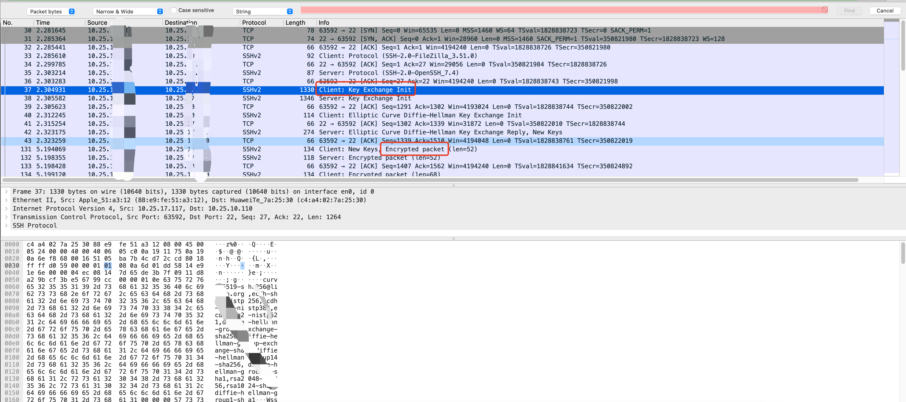
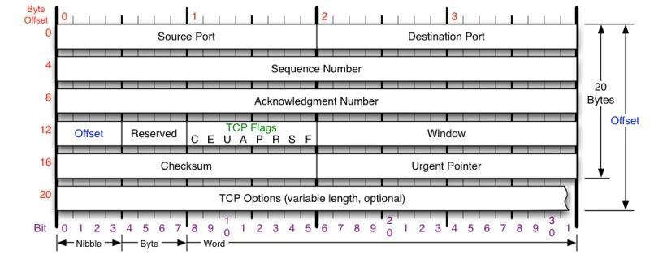
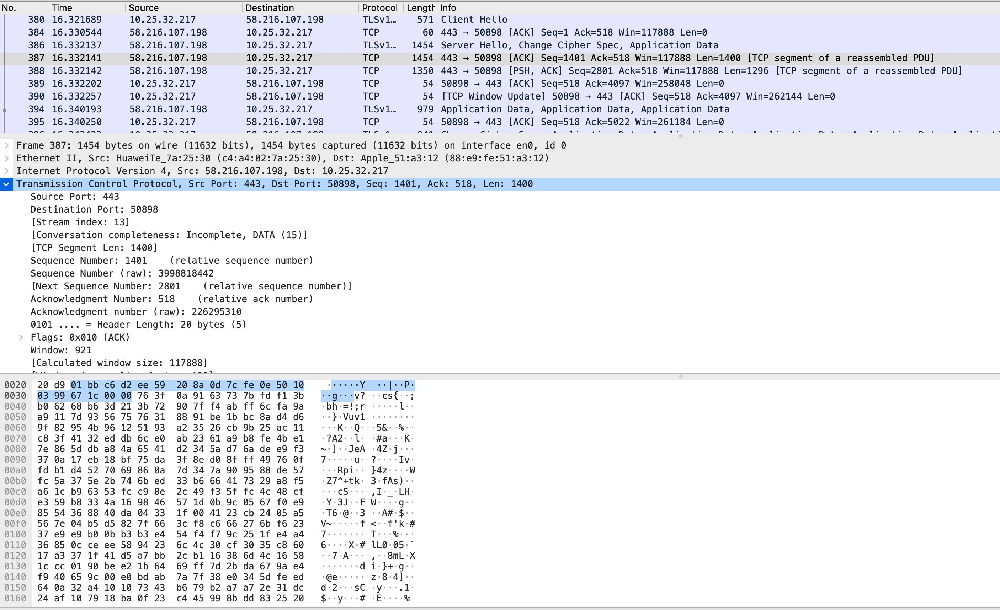
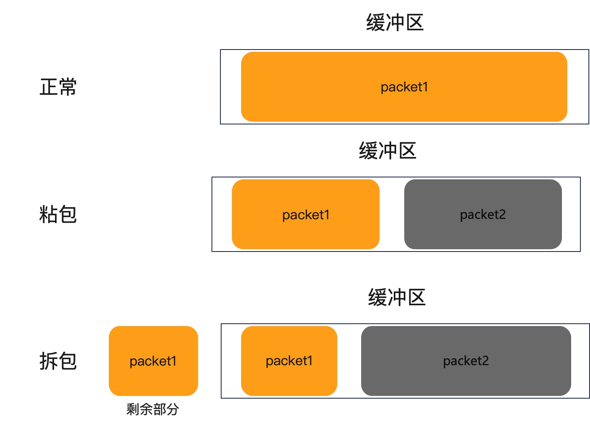
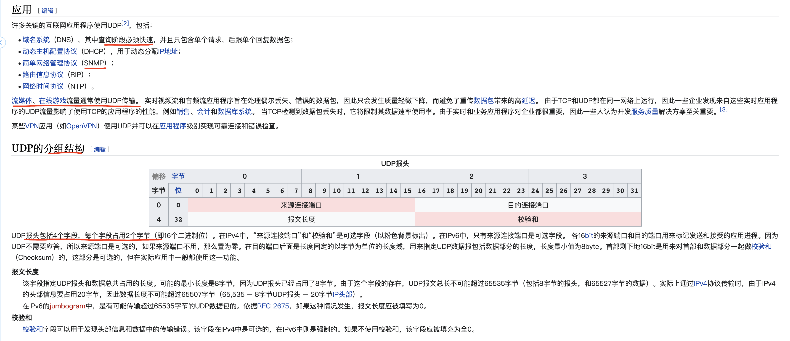
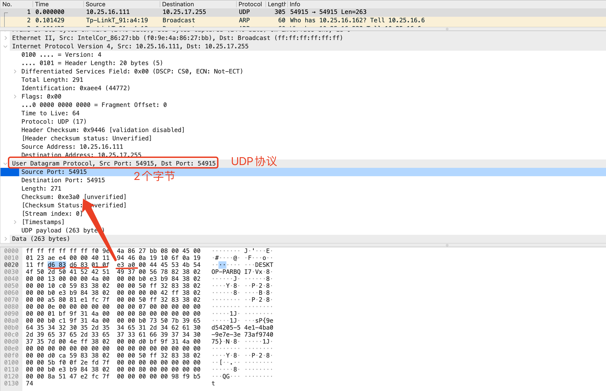
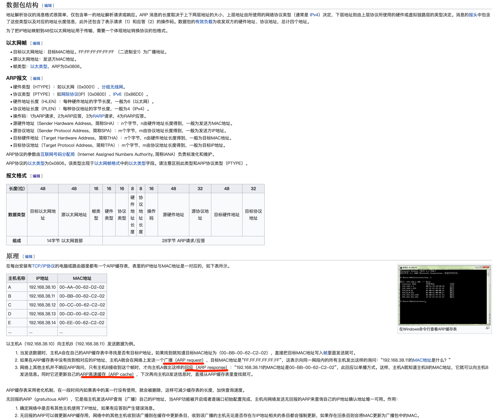
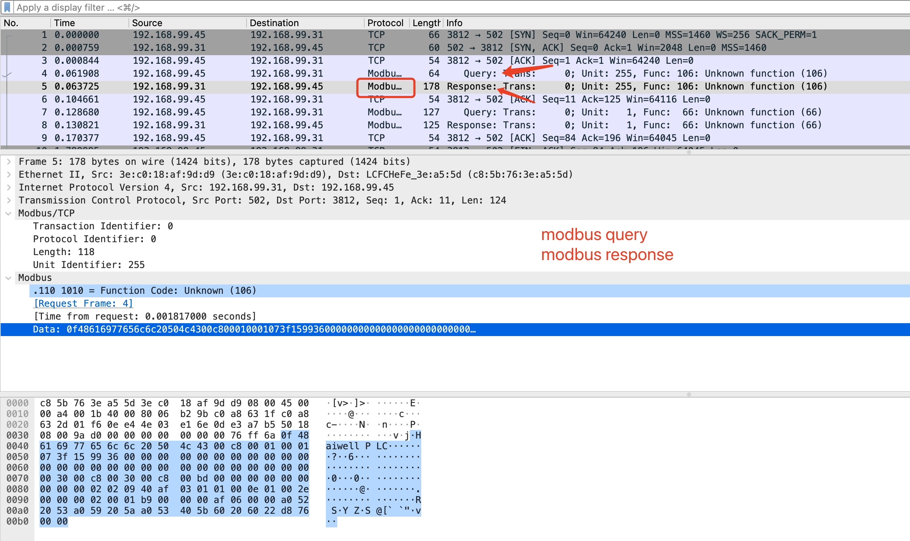
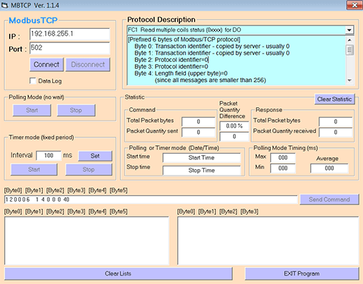

# 1.8 网络协议概要
- [网络分层](#网络分层)
- [网络协议介绍](#网络协议介绍)
  - [应用层](#应用层)
    - [HTTP](#http)
    - [SNMP](#snmp)
    - [FTP](#ftp)
    - [Telnet](#telnet)
- [传输层](#传输层)
    - [TCP(传输控制协议)](#tcp传输控制协议)
    - [UDP(用户数据报协议)](#udp用户数据报协议)
- [数据链路层](#数据链路层)
    - [ARP](#arp)
    - [MTU](#mtu)
- [工业协议](#工业协议)
  - [Modbus](#modbus)
  - [S7](#s7)

## 网络分层  

| OSI中的层 | 功能 | TCP/IP协议族 |
| -------- | --- | ----------- |
| 应用层 | 文件传输，电子邮件，文件服务，虚拟终端 | TFTP，HTTP，SNMP，FTP，SMTP，DNS，Telnet | 
| 表示层 | 数据格式化，代码转换，数据加密 | 没有协议 | 
| 会话层 | 解除或建立与别的接点的联系 | 没有协议 | 
| 传输层 | 提供端对端的接口 | TCP，UDP |
| 网络层 | 为数据包选择路由 | IP，ICMP，RIP，OSPF，BGP，IGMP | 
| 数据链路层 | 传输有地址的帧以及错误检测功能 | SLIP，CSLIP，PPP，ARP，RARP，MTU | 
| 物理层 | 以二进制数据形式在物理媒体上传输数据 | ISO2110,IEEE802,IEEE802.2 | 

## 网络协议介绍  
### 应用层  
#### HTTP(Hypertext Transfer Protocol) 
#### SNMP(Simple Network Management Protocol)


#### FTP(File Transfer Protocol) 
FTP服务一般运行在20和21两个端口。端口20用于在客户端和服务器之间传输数据流，而端口21用于传输控制流，并且是命令通向ftp服务器的进口。当数据通过数据流传输时，控制流处于空闲状态。而当控制流空闲很长时间后，客户端的防火墙会将其会话置为超时，这样当大量数据通过防火墙时，会产生一些问题。此时，虽然文件可以成功的传输，但因为控制会话，会被防火墙断开；传输会产生一些错误。  

- ##### 主动和被动模式  

主动模式要求客户端和服务器端同时打开并且监听一个端口以创建连接。在这种情况下，客户端由于安装了防火墙会产生一些问题。所以，创立了被动模式。被动模式只要求服务器端产生一个监听相应端口的进程，这样就可以绕过客户端安装了防火墙的问题。  

ftp主动模式工作流程:  

<br>
<div align=center>
    </img>  
</div>
<br>

- ##### 浏览器访问  

大部分常见的网页浏览器都可以检索FTP服务器上托管的文件，尽管它们并不支持扩展协议，如FTPS。当浏览器访问FTP格式的URL时，将以Web文件目录显示远程服务器上的可访问内容。  

```shell
ftp://[user[:password]@]host[:port]/url-path  
```

- ##### 衍生品  

FTPS是FTP标准的扩展，添加了安全套接层（SSL）以及其继任者传输层安全性协议（TLS）的支持。  

SSH文件传输协议（缩写：SFTP）可用于传输文件并具有类似的用户命令集，但使用Secure Shell协议（SSH）传输文件。与FTP不同，它对命令和数据进行加密，防止密码和敏感信息通过网络公开传输。它无法与FTP兼容。  

> Secure Shell（安全外壳协议，简称SSH）是一种加密的网络传输协议，可在不安全的网络中为网络服务提供安全的传输环境。在设计上，**SSH是Telnet和非安全shell的替代品**。Telnet和Berkeley rlogin、rsh、rexec等协议采用明文传输，使用不可靠的密码，容易遭到监听、嗅探和中间人攻击。SSH旨在保证非安全网络环境（例如互联网）中信息加密完整可靠。  
> SSH以非对称加密实现身份验证。公钥需要放在待访问的电脑之中，而对应的私钥需要由用户自行保管。认证过程基于生成出来的私钥，但整个认证过程中私钥本身不会传输到网络中。  


  

小型文件传输协议（Trivial File Transfer Protocol, TFTP），是一种于1981年在RFC 783中定义的简化的文件传输协议（FTP）  

简单文件传输协议（Simple File Transfer Protocol）由RFC 913定义，其复杂程度介于TFTP和FTP之间。它从未在互联网上被广泛接受。它通过端口115运行，支持三种类型的数据传输： ASCII 、 二进制和连续。该协议还支持使用用户名和密码登录、文件夹和文件管理（包括重命名、删除、上传、下载）。  


> vsftpd（very secure FTP daemon，意为非常安全的FTP守护进程）[1]是一个类Unix系统以及Linux上的FTP服务器软件。  

- ##### FTP环境搭建  

[docker hub 镜像地址](https://hub.docker.com/r/delfer/alpine-ftp-server)  

```
docker pull delfer/alpine-ftp-server
docker run -d  \
    -p 21:21 \
    -p 21000-21010:21000-21010 \
    -e USERS="user|1234qwer+-" \
    -e ADDRESS=10.25.17.117 \
    delfer/alpine-ftp-server
```

通过浏览器访问: `ftp://10.25.17.117`,通过用户民及密码登录后:  
```shell
Tue Mar  8 06:20:00 2022 [pid 47] CONNECT: Client "172.17.0.1"
Tue Mar  8 06:20:00 2022 [pid 49] CONNECT: Client "172.17.0.1"
Tue Mar  8 06:20:00 2022 [pid 46] [user] OK LOGIN: Client "172.17.0.1"
Tue Mar  8 06:20:00 2022 [pid 48] [user] OK LOGIN: Client "172.17.0.1"
Tue Mar  8 06:20:00 2022 [pid 53] CONNECT: Client "172.17.0.1"
Tue Mar  8 06:20:00 2022 [pid 52] [user] OK LOGIN: Client "172.17.0.1"
```

[FTP协议pcap文件示例](res/files/pcap/ftp-login.pcapng)  

请求的用户名报文:  
```
# Hex + ASCII  
0000   02 00 00 00 45 00 00 3f 00 00 40 00 40 06 00 00   ....E..?..@.@...
0010   0a 19 11 75 0a 19 11 75 ff 38 00 15 cb e0 92 db   ...u...u.8......
0020   ed 6f 65 b9 80 18 18 eb 37 4d 00 00 01 01 08 0a   .oe.....7M......
0030   13 cc fa 82 e9 8d 34 21 55 53 45 52 20 75 73 65   ......4!USER use
0040   72 0d 0a                                          r..

# Hex 
020000004500003f00004000400600000a1911750a191175ff380015cbe092dbed6f65b9801818eb374d00000101080a13ccfa82e98d34215553455220757365720d0a
```

请求密码报文:  
```
# Hex + ASCII  
0000   02 00 00 00 45 00 00 43 00 00 40 00 40 06 00 00   ....E..C..@.@...
0010   0a 19 11 75 0a 19 11 75 ff 38 00 15 cb e0 92 e6   ...u...u.8......
0020   ed 6f 66 2d 80 18 18 e9 37 51 00 00 01 01 08 0a   .of-....7Q......
0030   13 cc fa 85 e9 8d 34 24 50 41 53 53 20 31 32 33   ......4$PASS 123
0040   34 71 77 65 72 0d 0a                              4qwer..

# Hex
020000004500004300004000400600000a1911750a191175ff380015cbe092e6ed6f662d801818e9375100000101080a13ccfa85e98d3424504153532031323334717765720d0a
```

#### Telnet 
Telnet是一种应用层协议，使用于互联网及局域网中，使用虚拟终端的形式，提供双向、以文字字符串为主的命令行接口交互功能。属于TCP/IP协议族的其中之一，是互联网远程登录服务的标准协议和主要方式，常用于服务器的远程控制，可供用户在本地主机执行远程主机上的工作。  

- ##### 环境搭建  

centos 搭建telnet server 
```shell
# centos 环境搭建  
RUN yum install telnet-server telnet xinetd -y

# 启动  
systemctl start telnet.socket && systemctl start xinetd  

# 关闭防火墙
systemctl stop firewalld.service  

# 设置telnet用户，也可以是root用户  
adduser telnetUser
passwd telnetUser
```

客户端连接:  
```shell
▶ telnet 10.211.55.6
Trying 10.211.55.6...
Connected to d1.
Escape character is '^]'.
Password: 
Login incorrect

d1 login: telnetUser
Password: 
Last failed login: Tue Mar  8 18:56:53 CST 2022 from ::ffff:10.211.55.2 on pts/1
There was 1 failed login attempt since the last successful login.  
```

通过wireshark查看telnet协议，发现用户民一次传递过来，密码是分为多包传递的，而windows转包显示，用户名是分包发送的  

  


用户名的获取:  
```
# 要求输入用户名
Frame 188: 95 bytes on wire (760 bits), 95 bytes captured (760 bits) on interface sshdump, id 0
Ethernet II, Src: Parallel_d7:c2:da (00:1c:42:d7:c2:da), Dst: Parallel_00:00:08 (00:1c:42:00:00:08)
Internet Protocol Version 4, Src: 10.211.55.6, Dst: 10.211.55.2
Transmission Control Protocol, Src Port: 23, Dst Port: 49846, Seq: 67, Ack: 98, Len: 29
Telnet
    Data: Login incorrect\r\n
    Data: \r\n
    Data: d1 login: 

# 用户名信息
Frame 229: 76 bytes on wire (608 bits), 76 bytes captured (608 bits) on interface sshdump, id 0
Ethernet II, Src: Parallel_00:00:08 (00:1c:42:00:00:08), Dst: Parallel_d7:c2:da (00:1c:42:d7:c2:da)
Internet Protocol Version 4, Src: 10.211.55.2, Dst: 10.211.55.6
Transmission Control Protocol, Src Port: 49846, Dst Port: 23, Seq: 98, Ack: 96, Len: 10
Telnet
    Data: telnetUser
```

从多包发送来看，ack的序列号是一致的，seq顺序排列的，可以通过ack判断是不是一组数据的  
```shell
# 要求输入密码
Frame 235: 76 bytes on wire (608 bits), 76 bytes captured (608 bits) on interface sshdump, id 0
Ethernet II, Src: Parallel_d7:c2:da (00:1c:42:d7:c2:da), Dst: Parallel_00:00:08 (00:1c:42:00:00:08)
Internet Protocol Version 4, Src: 10.211.55.6, Dst: 10.211.55.2
Transmission Control Protocol, Src Port: 23, Dst Port: 49846, Seq: 108, Ack: 110, Len: 10
Telnet
    Data: Password: 

# 密码为1
Frame 250: 67 bytes on wire (536 bits), 67 bytes captured (536 bits) on interface sshdump, id 0
Ethernet II, Src: Parallel_00:00:08 (00:1c:42:00:00:08), Dst: Parallel_d7:c2:da (00:1c:42:d7:c2:da)
Internet Protocol Version 4, Src: 10.211.55.2, Dst: 10.211.55.6
Transmission Control Protocol, Src Port: 49846, Dst Port: 23, Seq: 110, Ack: 118, Len: 1
Telnet
    Data: 1

# 密码为2
Frame 252: 67 bytes on wire (536 bits), 67 bytes captured (536 bits) on interface sshdump, id 0
Ethernet II, Src: Parallel_00:00:08 (00:1c:42:00:00:08), Dst: Parallel_d7:c2:da (00:1c:42:d7:c2:da)
Internet Protocol Version 4, Src: 10.211.55.2, Dst: 10.211.55.6
Transmission Control Protocol, Src Port: 49846, Dst Port: 23, Seq: 111, Ack: 118, Len: 1
Telnet
    Data: 2

# 密码为3  
Frame 268: 67 bytes on wire (536 bits), 67 bytes captured (536 bits) on interface sshdump, id 0
Ethernet II, Src: Parallel_00:00:08 (00:1c:42:00:00:08), Dst: Parallel_d7:c2:da (00:1c:42:d7:c2:da)
Internet Protocol Version 4, Src: 10.211.55.2, Dst: 10.211.55.6
Transmission Control Protocol, Src Port: 49846, Dst Port: 23, Seq: 112, Ack: 118, Len: 1
Telnet
    Data: 3

... 4qwer ...

# 换行结尾
Frame 314: 68 bytes on wire (544 bits), 68 bytes captured (544 bits) on interface sshdump, id 0
Ethernet II, Src: Parallel_00:00:08 (00:1c:42:00:00:08), Dst: Parallel_d7:c2:da (00:1c:42:d7:c2:da)
Internet Protocol Version 4, Src: 10.211.55.2, Dst: 10.211.55.6
Transmission Control Protocol, Src Port: 49846, Dst Port: 23, Seq: 118, Ack: 118, Len: 2
Telnet
    Data: \r

Frame 316: 68 bytes on wire (544 bits), 68 bytes captured (544 bits) on interface sshdump, id 0
Ethernet II, Src: Parallel_d7:c2:da (00:1c:42:d7:c2:da), Dst: Parallel_00:00:08 (00:1c:42:00:00:08)
Internet Protocol Version 4, Src: 10.211.55.6, Dst: 10.211.55.2
Transmission Control Protocol, Src Port: 23, Dst Port: 49846, Seq: 118, Ack: 120, Len: 2
Telnet
    Data: \r\n

```

通过TCP的ACK序列号即可判断。  


## 传输层
### TCP(传输控制协议)   

TCP 其实是非常复杂的协议，我们先聊一些基础的。我们知道 TCP 是一种可靠的协议，它主要通过解决这几个问题来实现可靠性的，分别是：乱序、丢包重传、流控、拥塞控制。通过从图中报文格式的字段，也能够简单了解到 TCP 的相关概念。

TCP协议结构: 
 

TCP 在网络 OSI 七层模型中的第四层，TCP 包是没有 IP 地址的，但有源端口和目的端口，用来标识通信的进程。

- `Sequence Number` 是记录包的序号，TCP 会按照报文字节进行编号，它是用来解决包在网络中乱序的问题。

- `Acknowledgement Number` 确认序列号，是用于向发送方确认已经收到了哪些包，用来解决不丢包的问题。

- `Windows` 也叫 `Advertised-Windows`，也就是著名的滑动窗口，主要是用来解决流控的。

- `TCP Flag` 就是包的类型，主要是用于操控 TCP 状态机的。

数据包样例:  
  

- #### 校验和(checksum)  

TCP校验和（Checksum）是一个端到端的校验和，由发送端计算，然后由接收端验证。其目的是为了发现TCP首部和数据在发送端到接收端之间发生的任何改动。如果接收方检测到校验和有差错，则TCP段会被直接丢弃。  

TCP校验和覆盖TCP首部和TCP数据，而IP首部中的校验和只覆盖IP的首部，不覆盖IP数据报中的任何数据。TCP校验和、IP校验和的计算方法是基本一致的，除了计算的范围不同。

TCP的校验和是必需的，而UDP的校验和是可选的。TCP和UDP计算校验和时，都要加上一个12字节的伪首部。

计算方式:  
1. 把伪首部、TCP报头、TCP数据分为16位的字，如果总长度为奇数个字节，则在最后增添一个位都为0的字节。把TCP报头中的校验和字段置为0（否则就陷入鸡生蛋还是蛋生鸡的问题）
2. 用反码相加法累加所有的16位字（进位也要累加）
3. 对计算结果取反，作为TCP的校验和

> 如果拦截客户端或服务端发送的包，修改数据包，重新计算校验和不就可以造成欺骗吗？  


- #### TCP三次握手  

[参考文章](https://www.eet-china.com/mp/a44399.html)  

<br>
<div align=center>
    </img>  
</div>
<br>

TCP 三次握手，其实就是建立一个TCP连接，客户端与服务器交互需要3个数据包。握手的主要作用就是为了确认双方的接收和发送能力是否正常，初始序列号，交换窗口大小以及 MSS 等信息。

- 第一次握手：客户端发送`SYN`报文，并进入`SYN_SENT`状态，等待服务器的确认；

- 第二次握手：服务器收到`SYN`报文，需要给客户端发送`ACK`确认报文，同时服务器也要向客户端发送一个`SYN`报文，所以也就是向客户端发送`SYN + ACK`报文，此时服务器进入`SYN_RCV`状态；

- 第三次握手：客户端收到`SYN + ACK`报文，向服务器发送确认包，客户端进入 `ESTABLISHED` 状态。待服务器收到客户端发送的 `ACK` 包也会进入 `ESTABLISHED` 状态，完成三次握手。

我们回答时，可以先简单概述 TCP 过程，然后三次握手具体描述时，需要说明状态的基本转换。

TCP 三次握手，其实就是 TCP 应用在发送数据前，通过 TCP 协议跟通信对方协商好连接信息，建立起TCP的连接关系。

我们需要知道，**TCP连接并非是在通信设备两端之间建立信号隧道，而本质上就是双方各自维护所需的状态状态，以达到 TCP 连接的效果**。所以TCP状态机是TCP的核心内容，学习TCP一定要搞懂这些状态机之间的转换。

- #### 初始序列号（ISN）

ISN 全称是 Initial Sequence Number，是 TCP 发送方的字节数据编号的原点，告诉对方我要开始发送数据的初始化序列号;  
ISN 如果是固定的，攻击者很容易猜出后续的确认序号，为了安全起见，避免被第三方猜到从而发送伪造的 RST 报文，因此 ISN 是动态生成的  

- #### TCP 四次挥手

当我们的应用程序不需要数据通信了，就会发起断开 TCP 连接。建立一个连接需要三次握手，而终止一个连接需要经过四次挥手。  

<br>
<div align=center>
    </img>  
</div>
<br>

-第一次挥手。客户端发起`FIN`包（FIN=1）,客户端进入`FIN_WAIT_1`状态。TCP规定，即使`FIN`包不携带数据，也要消耗一个序号。

-第二次挥手。服务器端收到`FIN`包，发出确认包`ACK`（ack=u+1），并带上自己的序号seq=v，服务器端进入了`CLOSE_WAIT`状态。这个时候客户端已经没有数据要发送了，不过服务器端有数据发送的话，客户端依然需要接收。客户端接收到服务器端发送的ACK后，进入了`FIN_WAIT_2`状态。

-第三次挥手。服务器端数据发送完毕后，向客户端发送`FIN`包（seq=wack=u+1），半连接状态下服务器可能又发送了一些数据，假设发送seq为w。服务器此时进入了`LAST_ACK`状态。

-第四次挥手。客户端收到服务器的FIN包后，发出确认包（ACK=1，ack=w+1），此时客户端就进入了`TIME_WAIT`状态。注意此时TCP连接还没有释放，必须经过2*MSL后，才进入`CLOSED`状态。而服务器端收到客户端的确认包`ACK`后就进入了`CLOSED`状态，可以看出服务器端结束TCP连接的时间要比客户端早一些。

- #### TCP 拆包与粘包  
[参考文章](https://cloud.tencent.com/developer/article/1804413)  
什么是粘包？
在学习粘包之前，先纠正一下读音，很多视频教程中将“粘”读作“nián”。经过调研，个人更倾向于读“zhān bāo”。

如果在百度百科上搜索“粘包”，对应的读音便是“zhān bāo”，语义解释为：网络技术术语。指TCP协议中，发送方发送的若干包数据到接收方接收时粘成一包，从接收缓冲区看，后一包数据的头紧接着前一包数据的尾。

TCP是面向字节流的协议，就是没有界限的一串数据，本没有“包”的概念，“粘包”和“拆包”一说是为了有助于形象地理解这两种现象。

- 为什么UDP没有粘包？  
粘包拆包问题在数据链路层、网络层以及传输层都有可能发生。日常的网络应用开发大都在传输层进行，由于UDP有**消息保护边界**，不会发生粘包拆包问题，因此粘包拆包问题只发生在TCP协议中。

因为TCP是面向流，没有边界，而操作系统在发送TCP数据时，会通过**缓冲区**来进行优化，例如缓冲区为1024个字节大小。

如果一次请求发送的数据量比较小，没达到缓冲区大小，TCP则会将多个请求**合并**为同一个请求进行发送，这就形成了**粘包问题**。

如果一次请求发送的数据量比较大，**超过了缓冲区大小**，TCP就会将其拆分为多次发送，这就是**拆包**。  

<br>
<div align=center>
    </img>  
</div>
<br>

对于粘包和拆包问题，常见的解决方案有四种：

- 发送端将每个包都封装成固定的长度，比如100字节大小。如果不足100字节可通过补0或空等进行填充到指定长度；
- 发送端在每个包的末尾使用固定的分隔符，例如\r\n。如果发生拆包需等待多个包发送过来之后再找到其中的\r\n进行合并；例如，FTP协议；
- 将消息分为头部和消息体，头部中保存整个消息的长度，只有读取到足够长度的消息之后才算是读到了一个完整的消息；
- 通过自定义协议进行粘包和拆包的处理。  


### UDP(用户数据报协议)   

UDP协议应用及结构:  



数据包样例:  
  

文本示例:  
```shell
Frame 52: 74 bytes on wire (592 bits), 74 bytes captured (592 bits) on interface sshdump, id 0
Ethernet II, Src: Parallel_00:00:18 (00:1c:42:00:00:18), Dst: Parallel_d7:c2:da (00:1c:42:d7:c2:da)
Internet Protocol Version 4, Src: 10.211.55.1, Dst: 10.211.55.6
User Datagram Protocol, Src Port: 53, Dst Port: 39343
    Source Port: 53
    Destination Port: 39343
    Length: 40
    Checksum: 0xf435 [unverified]
    [Checksum Status: Unverified]
    [Stream index: 1]
    [Timestamps]
        [Time since first frame: 0.000362000 seconds]
        [Time since previous frame: 0.000009000 seconds]
    UDP payload (32 bytes)
Domain Name System (response)
```

> UDP中checksum功能是可选的  

- #### UDP消息边界  

TCP 是流式的数据传输，消息没有边界，需要应用层自己去定义消息边界，而 UDP 是数据报传输，所以协议保证了一次只能接收一个数据报。  

udp数据包的理论长度是多少，合适的udp数据包应该是多少呢？从TCP-IP详解卷一第11章的udp数据包的包头可以看出，udp的最大包长度是2^16-1的个字节。由于udp包头占8个字节，而在ip层进行封装后的ip包头占去20字节，所以这个是udp数据包的最大理论长度是2^16-1-8-20=65507。  

> tcpdump 在捕获期间将 UDP 数据包中的有用数据截断为 1472 字节 ?  

如果 IP 数据包大于发送数据包的网络链路的 MTU，IP 会将其分段为适合网络的 IP 数据包；这是由 IP 层完成的，而不是 UDP 层。  
以太网的 MTU 通常为 1500 字节（以太网数据包最大大小为 1518，其中包括 14 字节的报头、1500 字节的有效负载和 4 字节的 FCS）。如果没有选项，IPv4 标头为 20 字节，而 UDP 标头为 8 字节，因此最大 UDP 有效负载大小为 1500-28 = 1472。  

因此IP将数据包分成两个或多个片段，并在接收机器上重新组合它们。  

通过sendIP发送测试数据试试，看看UDP超过1500字节的负载会如何处理?  

```shell
sendip -p ipv4 -is 192.168.1.2 -id 192.168.0.87 -p udp -d 0x89ABCDEFAABBCCDDGGF5B7 192.168.0.87 -v
sendip -v -p ipv4 -is 192.168.1.2 -id 192.168.1.1 -p tcp -d 0x8AABBCCDD 192.168.1.1
```

无法发送超长数据:  
```shell
Setting socket options:
 IP_HDRINCL
sendto: Message too long
Freeing module ipv4
Freeing module udp
```

- #### UDP丢包  

udp丢包是指网卡接收到数据包后，linux内核的tcp/ip协议栈在udp数据包处理过程中的丢包，主要原因有两个：
1. udp数据包格式错误或校验和检查失败。
2. 应用程序来不及处理udp数据包。


## 数据链路层
#### ARP(Address Resolution Protocol)  
ARP是一个通过解析网络层地址来找寻数据链路层地址的网络传输协议，它在IPv4中极其重要。ARP最初在1982年的RFC 826（征求意见稿）中提出并纳入互联网标准STD 37。ARP也可能指是在多数操作系统中管理其相关地址的一个进程。  

ARP是通过网络地址来定位**MAC地址**。 ARP已经在很多网路层和数据链接层之间得以实现，包括IPv4、Chaosnet、DECnet和Xerox PARC Universal Packet（PUP）使用IEEE 802标准， 光纤分布式数据接口， X.25，帧中继和异步传输模式（ATM），IEEE 802.3和IEEE 802.11标准上IPv4占了多数流量。    

   

arp报文实例:  
```
# arp请求报文: 10.211.55.6 请求获取 10.211.55.1 mac地址

Frame 4: 42 bytes on wire (336 bits), 42 bytes captured (336 bits) on interface sshdump, id 0
Ethernet II, Src: Parallel_d7:c2:da (00:1c:42:d7:c2:da), Dst: Parallel_00:00:18 (00:1c:42:00:00:18)
Address Resolution Protocol (request)
    Hardware type: Ethernet (1)
    Protocol type: IPv4 (0x0800)
    Hardware size: 6
    Protocol size: 4
    Opcode: request (1)
    Sender MAC address: Parallel_d7:c2:da (00:1c:42:d7:c2:da)
    Sender IP address: 10.211.55.6
    Target MAC address: 00:00:00_00:00:00 (00:00:00:00:00:00)
    Target IP address: 10.211.55.1

# arp响应报文: 10.211.55.1 响应 10.211.55.6，发送自己的mac地址  

Frame 5: 42 bytes on wire (336 bits), 42 bytes captured (336 bits) on interface sshdump, id 0
Ethernet II, Src: Parallel_00:00:18 (00:1c:42:00:00:18), Dst: Parallel_d7:c2:da (00:1c:42:d7:c2:da)
Address Resolution Protocol (reply)
    Hardware type: Ethernet (1)
    Protocol type: IPv4 (0x0800)
    Hardware size: 6
    Protocol size: 4
    Opcode: reply (2)
    Sender MAC address: Parallel_00:00:18 (00:1c:42:00:00:18)
    Sender IP address: 10.211.55.1
    Target MAC address: Parallel_d7:c2:da (00:1c:42:d7:c2:da)
    Target IP address: 10.211.55.6
```


- ##### ARP攻击  

ARP 是一种非常不安全的协议，目前已经有很多涉及 ARP 的攻击，最主要的就是使用代理 ARP 功能假扮主机，对 ARP 请求作出应答，通过伪造 ARP 数据包来窃取合法用户的通信数据，造成影响网络传输速率和盗取用户隐私信息等严重危害。  

ARP 主要攻击方式分为下面这几种
- ARP 泛洪攻击：通过向网关发送大量 ARP 报文，导致网关无法正常响应。首先发送大量的 ARP 请求报文，然后又发送大量虚假的 ARP 响应报文，从而造成网关部分的 CPU 利用率上升难以响应正常服务请求，而且网关还会被错误的 ARP 缓存表充满导致无法更新维护正常 ARP 缓存表，消耗网络带宽资源。  

- ARP 欺骗主机攻击：ARP 欺骗主机的攻击也是 ARP 众多攻击类型中很常见的一种。攻击者通过 ARP 欺骗使得局域网内被攻击主机发送给网关的流量信息实际上都发送给攻击者。主机刷新自己的 ARP 使得在自己的ARP 缓存表中对应的 MAC 为攻击者的 MAC，这样一来其他用户要通过网关发送出去的数据流就会发往主机这里，这样就会造成用户的数据外泄。

- 欺骗网关的攻击: 欺骗网关就是把别的主机发送给网关的数据通过欺骗网关的形式使得这些数据通过网关发送给攻击者。这种攻击目标选择的不是个人主机而是局域网的网关，这样就会攻击者源源不断的获取局域网内其他用户韵数据．造成数据的泄露，同时用户电脑中病毒的概率也会提升。  

- 中间人攻击: 中间人攻击是同时欺骗局域网内的主机和网关，局域网中用户的数据和网关的数据会发给同一个攻击者，这样，用户与网关的数据就会泄露。  

- IP地址冲突攻击: 通过对局域网中的物理主机进行扫描，扫描出局域网中的物理主机的 MAC 地址，然后根据物理主机的 MAC 进行攻击，导致局域网内的主机产生 IP 地址冲突，影响用户的网络正常使用。  


#### MTU 

## 工业协议 

| 总线名称 | 技术特点 | 主要应用场合 | 技术支持的公司 | 
| ------- | ------- | --------- | ---------- | 
| FF | 功能强大，实时性好，总线供电：但协议复杂，实际应用少 | 流程控制、工业过程控制、化工{如防爆环境） | Honeywell. ABB. Foxboro（ 已被施耐德收购）艾默生、ConCab等| 
| HART | 兼有惯拟仪表性能和数字通信性能；允许问答式及成组通信方式 | 现场仪表 | 西门子， ROCKSENSOR 艾默生、福禄克 伊顿公司、横河等 | 
| CAN | 采用短锁，抗干扰能力强；但速度较慢 | 汽车检測、控制 | Siemens. BOSCH、贝加菜（已被ABB收购）Philips. Honeywell. 研华科技等 | 
| LONWORKS | 支持OSI七层协议，实际应用较多 | 楼宇自动化、工业、能源 | Echelon.Honeywell. ABB. 施耐德、Philips、HMS等 | 
| DeviceNet | 短帧传输；无破坏性的逐位仲裁技术；应用较多 | 制造业，工业控制．电力系统  | Rockwell Automation. 施耐德、 ABB、Beckhoff、菲尼克斯、Contemporary Controls等 | 
| INTERBUS | 开放性好，兼容性强，实际应用较多 | 过程控制  | 菲尼克斯、Siemens. 研华科技、Rockwell、Automation. HMS等 | 
| PROFIBUS | 总线供电，实际应用较多;但支持的传输介质较少，传输方式单- | 过程自动化、制造业、楼宇自动化 | Siemens. 施耐德、ABB、 贝加菜（己彼ABB收购）．艾默生、横河、HMS等 | 
| WorldFIP | 具有较强的抗干扰能力，实时性好，稳定性强 | 工业过程控制  | Honeywell. BAILEY &MACKEY、施耐德、Alstom. Siemens等 | 
| CC-Link | 具有优异的抗噪性能和兼容性 ，使用简单，应用广泛 | 工业 | 三菱电机。Molex.倍加福、 Contec、IDEC、NEC. HMS等 | 
| Modbus | 标准、开放：可以支持多种电气接口，如RS-485等：应用较多 |  工业控制 | 施耐德、Honeywell、ABB、艾默生、Deutschmann等 | 

### Modbus  

modbus协议样例: 

  

可以模拟modbus协议  [modbus_tcp_client](res/files/Modbus_tcp_client.zip)  

  


### S7  

