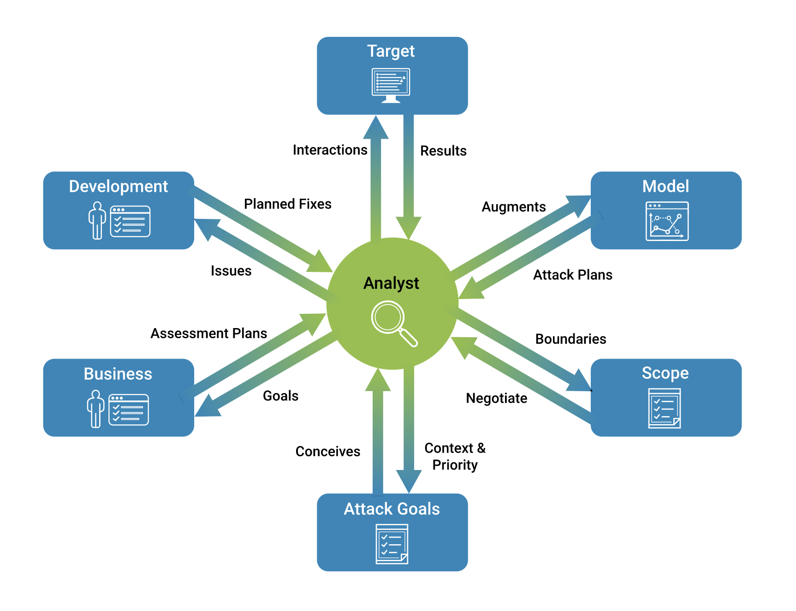
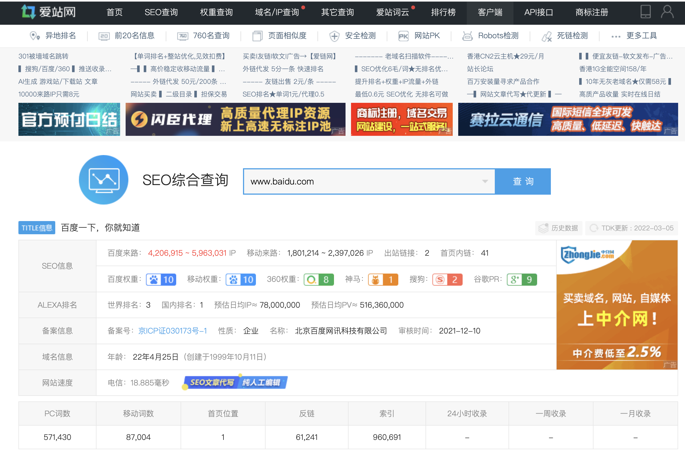
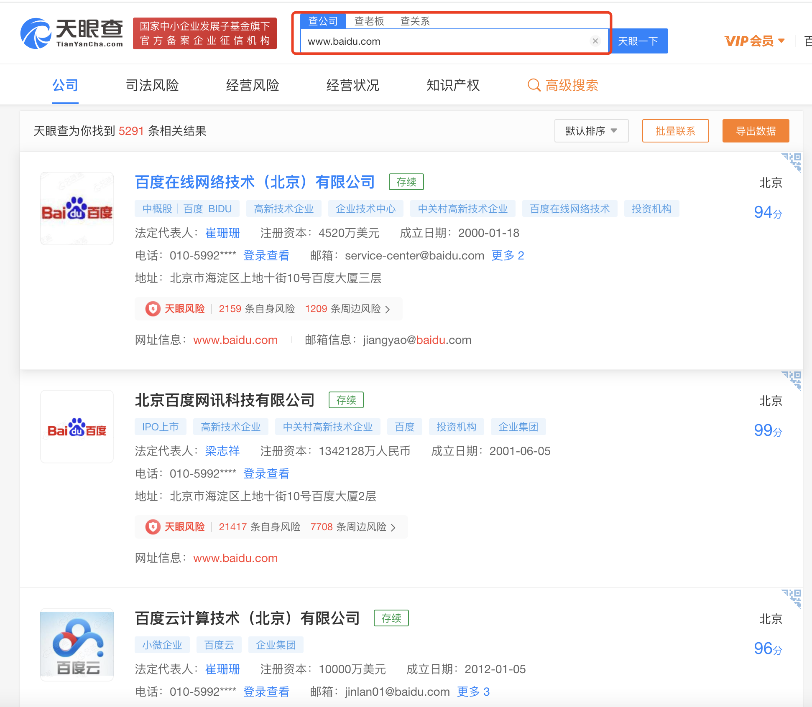
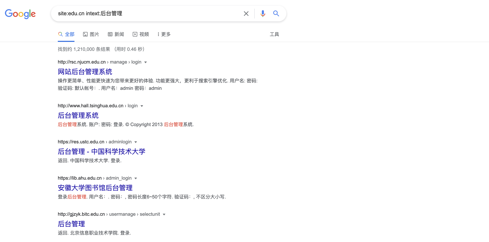

- [渗透测试](#渗透测试)
- [1.1 收集域名信息](#11-收集域名信息)
  - [Whois查询](#whois查询)
  - [备案信息查询](#备案信息查询)
- [1.2 收集敏感信息](#12-收集敏感信息)
- [1.3 收集子域名信息](#13-收集子域名信息)
- [1.4 收集常用端口信息](#14-收集常用端口信息)
- [1.5 指纹识别](#15-指纹识别)
- [1.6 查找真实IP](#16-查找真实ip)
- [1.7 收集敏感目录文件](#17-收集敏感目录文件)
- [1.8 社会工程学](#18-社会工程学)

# 渗透测试  
[渗透测试](https://zh.wikipedia.org/wiki/%E6%B8%97%E9%80%8F%E6%B5%8B%E8%AF%95) ，**是为了证明网络防御按照预期计划正常运行而提供的一种机制**。不妨假设，你的公司定期更新安全策略和程序，时时给系统打补丁，并采用了漏洞扫描器等工具，以确保所有补丁都已打上。如果你早已做到了这些，为什么还要请外方进行审查或渗透测试呢？因为，渗透测试能够独立地检查你的网络策略，换句话说，就是给你的系统安了一双眼睛。而且，进行这类测试的，都是寻找网络系统安全漏洞的专业人士。  

[渗透测试-新思](https://www.synopsys.com/zh-cn/glossary/what-is-penetration-testing.html)  

渗透测试是一项在计算机系统上进行的授权模拟攻击，旨在对其安全性进行评估。渗透测试人员使用与攻击者相同的工具、技术和流程，来查找和展示系统弱点对业务带来的影响。  

渗透测试通常会模拟各种可能威胁您业务的攻击。渗透测试可以检查系统是否足够稳定，能否抵抗来自经过认证和未经认证的攻击，以及一系列系统角色发起的攻击。在合适的范围内，针对您需要评估的系统的任何方面，渗透测试都可以深入其中。  

**渗透测试类型**  
根据渗透测试的具体目标，组织针对目标系统向测试者提供不同级别的信息或访问权限。有时，渗透测试团队会在开始时设置一种方法并一直坚持下去。有时，测试团队会随着在渗透测试期间对系统认识的加深而改进其策略。在本行业中，我们讨论了三种类型的渗透测试：  

- 黑盒。团队对目标系统的内部结构一无所知。他们充当黑客，探寻任何可从外部发起攻击的弱点。  
- 灰盒。 团队对一套或多套凭证有一定了解。他们还了解目标的内部数据结构、代码和算法。渗透测试人员可以根据详细的设计文档（如目标系统的架构图），构建测试用例。  
- 白盒。 对于白盒测试，渗透测试人员可以访问系统和系统工件：源代码、二进制文件、容器，有时甚至是运行系统的服务器。白盒方法可在最短的时间内提供最高水平的安全保证。  

 

    </img>  

 

# 1.1 收集域名信息  
## Whois查询  

[Whois]((https://who.is/)) 是一个标准的互联网协议，可用于收集网络注册信息，注册的域名、IP地
址等信息。简单来说，Whois就是一个用于查询域名是否己被注册以及注册域名的详
细信息的数据库（如域名所有人、域名注册商)。  

[爱站工具网](https://www.aizhan.com/) 

 

    </img>  

 

## 备案信息查询  
网站备案是根据国家法律法规规定，需要网站的所有者向国家有关部门申请的
备案，这是国家信息产业部对网站的一种管理，为了防止在网上从事非法的网站经
营活动的发生。主要针对国内网站，如果网站搭建在其他国家，则不需要进行备案。

常用的网站有以下这两个:
- ICP备案查询网：http://www.beianbeian.com  
- 天眼查：http://www.tianyancha.com   

 

    </img>  

 

# 1.2 收集敏感信息  
Google是世界上最强的搜索引擎之一，对一位渗透测试者而言，它可能是一款绝
佳的黑客工具。我们可以通过构造特殊的关键字语法来搜索互联网上的相关敏感信
息。下面列举了一些Google的常用语法及其说明，如表1-1所示。  

| 关键字 | 说明 |  
| ----- | --- | 
| site | 指定域名 | 
| inurl | URL中存在关键字的网页 | 
| intext | 网页正文中的关键字 | 
| filetype | 指定文件类型 | 
| intitle | 网页标题中的关键字 | 
| link | link:xx.com 表示返回所有和xx.com 做了连接的URL | 
| info | 查找指定站点的一些基本信息 | 
| cache | 搜索Google里关于某些内容的缓存 |  

举个例子，我们尝试搜索一些学校网站的后台，语法为"site:edu.cn intext:后台管理"，意思是搜索网页正文中含有“后台管理”并且域名后缀是edu.cn的网站，搜索结果如图1-2所示:  

  

可以看到利用Google搜索，我们可以很轻松地得到想要的信息，还可以用它来收
集数据库文件、SOL注入、配置信息、源代码泄露、未授权访问和robots.txt等敏感信息  

# 1.3 收集子域名信息  

# 1.4 收集常用端口信息  

# 1.5 指纹识别  

# 1.6 查找真实IP  

# 1.7 收集敏感目录文件

# 1.8 社会工程学

