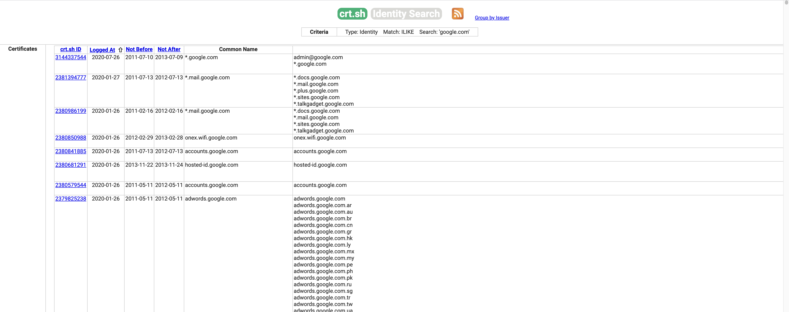
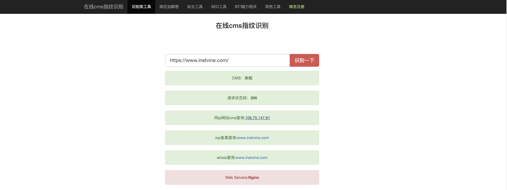
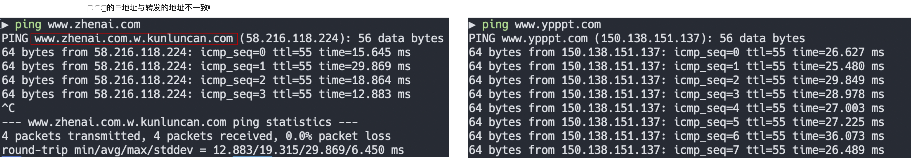
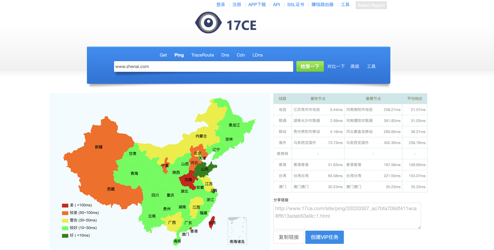
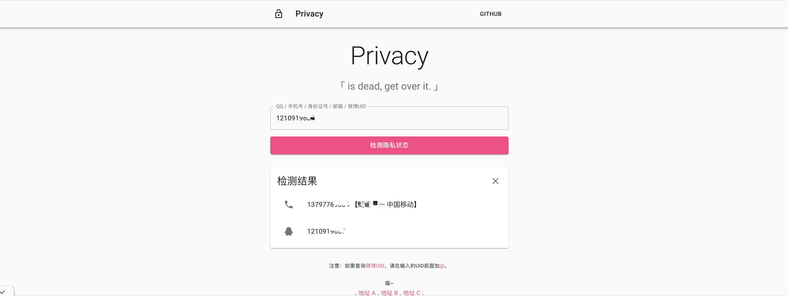

- [渗透测试](#渗透测试)
- [1.1 收集域名信息](#11-收集域名信息)
  - [Whois查询](#whois查询)
  - [备案信息查询](#备案信息查询)
- [1.2 收集敏感信息](#12-收集敏感信息)
- [1.3 收集子域名信息](#13-收集子域名信息)
- [1.4 收集常用端口信息](#14-收集常用端口信息)
- [1.5 指纹识别](#15-指纹识别)
- [1.6 查找真实IP](#16-查找真实ip)
- [1.7 收集敏感目录文件](#17-收集敏感目录文件)
- [1.8 社会工程学](#18-社会工程学)

# 渗透测试  
[渗透测试](https://zh.wikipedia.org/wiki/%E6%B8%97%E9%80%8F%E6%B5%8B%E8%AF%95) ，**是为了证明网络防御按照预期计划正常运行而提供的一种机制**。不妨假设，你的公司定期更新安全策略和程序，时时给系统打补丁，并采用了漏洞扫描器等工具，以确保所有补丁都已打上。如果你早已做到了这些，为什么还要请外方进行审查或渗透测试呢？因为，渗透测试能够独立地检查你的网络策略，换句话说，就是给你的系统安了一双眼睛。而且，进行这类测试的，都是寻找网络系统安全漏洞的专业人士。  

[渗透测试-新思](https://www.synopsys.com/zh-cn/glossary/what-is-penetration-testing.html)  

渗透测试是一项在计算机系统上进行的授权模拟攻击，旨在对其安全性进行评估。渗透测试人员使用与攻击者相同的工具、技术和流程，来查找和展示系统弱点对业务带来的影响。  

渗透测试通常会模拟各种可能威胁您业务的攻击。渗透测试可以检查系统是否足够稳定，能否抵抗来自经过认证和未经认证的攻击，以及一系列系统角色发起的攻击。在合适的范围内，针对您需要评估的系统的任何方面，渗透测试都可以深入其中。  

**渗透测试类型**  
根据渗透测试的具体目标，组织针对目标系统向测试者提供不同级别的信息或访问权限。有时，渗透测试团队会在开始时设置一种方法并一直坚持下去。有时，测试团队会随着在渗透测试期间对系统认识的加深而改进其策略。在本行业中，我们讨论了三种类型的渗透测试：  

- 黑盒。团队对目标系统的内部结构一无所知。他们充当黑客，探寻任何可从外部发起攻击的弱点。  
- 灰盒。 团队对一套或多套凭证有一定了解。他们还了解目标的内部数据结构、代码和算法。渗透测试人员可以根据详细的设计文档（如目标系统的架构图），构建测试用例。  
- 白盒。 对于白盒测试，渗透测试人员可以访问系统和系统工件：源代码、二进制文件、容器，有时甚至是运行系统的服务器。白盒方法可在最短的时间内提供最高水平的安全保证。  


<br>
<div align=center>
    </img>  
</div>
<br>


# 1.1 收集域名信息  
## Whois查询  

[Whois]((https://who.is/)) 是一个标准的互联网协议，可用于收集网络注册信息，注册的域名、IP地
址等信息。简单来说，Whois就是一个用于查询域名是否己被注册以及注册域名的详
细信息的数据库（如域名所有人、域名注册商)。  


[爱站工具网](https://www.aizhan.com/) 

<br>
<div align=center>
    </img>  
</div>
<br>


## 备案信息查询  
网站备案是根据国家法律法规规定，需要网站的所有者向国家有关部门申请的
备案，这是国家信息产业部对网站的一种管理，为了防止在网上从事非法的网站经
营活动的发生。主要针对国内网站，如果网站搭建在其他国家，则不需要进行备案。

常用的网站有以下这两个:
- ICP备案查询网：http://www.beianbeian.com  
- 天眼查：http://www.tianyancha.com   

<br>
<div align=center>
    </img>  
</div>
<br>


# 1.2 收集敏感信息  
Google是世界上最强的搜索引擎之一，对一位渗透测试者而言，它可能是一款绝
佳的黑客工具。我们可以通过构造特殊的关键字语法来搜索互联网上的相关敏感信
息。下面列举了一些Google的常用语法及其说明，如表1-1所示。  

| 关键字 | 说明 |  
| ----- | --- | 
| site | 指定域名 | 
| inurl | URL中存在关键字的网页 | 
| intext | 网页正文中的关键字 | 
| filetype | 指定文件类型 | 
| intitle | 网页标题中的关键字 | 
| link | link:xx.com 表示返回所有和xx.com 做了连接的URL | 
| info | 查找指定站点的一些基本信息 | 
| cache | 搜索Google里关于某些内容的缓存 |  

举个例子，我们尝试搜索一些学校网站的后台，语法为"site:edu.cn intext:后台管理"，意思是搜索网页正文中含有“后台管理”并且域名后缀是edu.cn的网站，搜索结果如图1-2所示:  

  

可以看到利用Google搜索，我们可以很轻松地得到想要的信息，还可以用它来收
集数据库文件、SOL注入、配置信息、源代码泄露、未授权访问和robots.txt等敏感信息  

# 1.3 收集子域名信息  
子域名也就是二级域名，是指顶级域名下的域名。假设我们的目标网络规模比
较大，直接从主域入手显然是很不理智的，因为对于这种规模的目标，一般其主域
都是重点防护区域，所以不如先进入目标的某个子域，然后再想办法迁回接近真正
的目标，这无疑是个比较好的选择。那么问题来了，怎样才能尽可能多地搜集目标
的高价值子域呢？常用的方法有以下这几种:  

- ### 子域名检测工具  
用于子域名检测的工具主要有**Layer子域名挖掘机**、K8、 wydomain、 Sublist3r、dnsmaper、subDomains Brute、Maltego CE等。笔者重点推荐Layer子域名挖掘机、Sublist3r和subDomainsBrute    


[Sublist3r安装地址](https://github.com/aboul3la/Sublist3r)  

安装指令:  
```shell
# 安装依赖
sudo pip install -r requirements.txt

# 安装
python3 setup.py install
```

在根目录运行:  
```
 python3 sublist3r.py -d baidu.com -t 50 -p 80,443,21,22
```

运行结果:  
```shell

                 ____        _     _ _     _   _____
                / ___| _   _| |__ | (_)___| |_|___ / _ __
                \___ \| | | | '_ \| | / __| __| |_ \| '__|
                 ___) | |_| | |_) | | \__ \ |_ ___) | |
                |____/ \__,_|_.__/|_|_|___/\__|____/|_|

                # Coded By Ahmed Aboul-Ela - @aboul3la
    
[-] Enumerating subdomains now for baidu.com
[-] Searching now in Baidu..
[-] Searching now in Yahoo..
[-] Searching now in Google..
[-] Searching now in Bing..
[-] Searching now in Ask..
[-] Searching now in Netcraft..
[-] Searching now in DNSdumpster..
[-] Searching now in Virustotal..
[-] Searching now in ThreatCrowd..
[-] Searching now in SSL Certificates..
[-] Searching now in PassiveDNS..
[!] Error: Virustotal probably now is blocking our requests

[-] Total Unique Subdomains Found: 2971
[-] Start port scan now for the following ports: 80,443,21,22
ai.baidu.com - Found open ports: 80, 443
www.baidu.com - Found open ports: 80, 443
8.baidu.com - Found open ports: 80, 443
adsdianying.baidu.com - Found open ports: 80, 443
creation.ai.baidu.com - Found open ports: 80, 443
activitydianying.baidu.com - Found open ports: 80, 443
1212.baidu.com - Found open ports: 80, 443
play.abcxueyuan.baidu.com - Found open ports: 80, 443
api.baidu.com - Found open ports: 80, 443
api-sao.baidu.com - Found open ports: 80, 443
aifanfan-material.baidu.com - Found open ports: 80, 443
Sip.baidu.com - Found open ports: 443
Webcon.baidu.com - Found open ports: 443
apidoc-duedge.baidu.com - Found open ports: 80, 443
autodiscover.baidu.com - Found open ports: 80, 443
...
```

错误: 
```shell
  File "sublist3r.py", line 304, in check_response_errors
    if (type(resp) is str or type(resp) is unicode) and 'Our systems have detected unusual traffic' in resp:
NameError: name 'unicode' is not defined

# 修改  
if (type(resp) is str)
```

- ### 搜索引擎枚举  
我们可以利用Google语法搜索子域名，例如要搜索百度旗下的子域名就可以使用
"site:baidu.com"

- ### 第三方应用聚合枚举
很多第三方服务汇聚了大量的DNS数据集，可通过它们检索某个给定域名的子域名。  
读者也可以利用DNSdumpster网站(https://dnsdumpster.com/),在线DNS侦查和搜索的工具挖掘出指定域潜藏的大量子域。     
 
<br>
<div align=center>
    </img>  
</div>
<br>

- ### 证书透明度公开日志枚举  
证书透明度 (Certificate Transparency，CT）是证书授权机构（CA）的一个项目，
证书授权机构会将每个SSL/TLS证书发布到公共日志中。一个SSL/TLS证书通常包含
域名、子域名和邮件地址，这些也经常成为攻击者非常希望获得的有用信息。查找
某个域名所属证书的最简单的方法就是使用搜素引擎搜索一些公开的CT日志。
笔者推荐crt.sh: https://crt.sh 和 censys: https://censys.io 这两个网站，下面展示了-
个crt.sh进行子域名枚举的例子，如图1-7所示:  

  


# 1.4 收集常用端口信息  
在渗透测试的过程中，对端口信息的收集是一个很重要的过程，通过扫描服务
器开放的端口以及从该端口判断服务器上存在的服务，就可以对症下药，便于我们
滲透目标服务器。  

所以在端口渗透信息的收集过程中，我们需要关注常见应用的默认端口和在端
口上运行的服务。最常见的扫描工具就是Nmap（具体的使用方法后续章节会详细介
绍），无状态端口扫描工具Masscan、ZMap和御剑高速TCP端口扫描工具。  

文件共享服务器端口:  
| 端口号 | 端口说明 | 攻击方向 | 
| ----- | ------- | ------ |
| 21/22/69 | Ftp/Tftp 文件传输协议 | 允许匿名上传、下载、爆破和嗅探操作 |  
| 2049 | Nfs 服务 | 配置不当 | 
| 139 | Samba服务 | 爆破、未授权访问、远程代码执行 |
| 389 | Ldap目录访问协议 | 注入、允许匿名访问、弱口令 |

远程连接服务端口
| 端口号 | 端口说明 | 攻击方向 | 
| ----- | ------- | ------ |
| 22 | SSH 远程连接 | 爆破、SSH 隧道及内网代理转发、文件传输 |
| 23 | Telnet 远程连接 | 爆破、嗅探、弱口令 |
| 3389 | Rdp远程桌面连接 | Shift 后门（需要 Windows Server 2003 以下的系统）、爆破 |
| 5900 | VNC | 弱口令爆破 |
| 5632 | PyAnywhere服务 | 抓密码、代码执行 |  

数据库服务端口
| 端口号 | 端口说明 | 攻击方向 | 
| ----- | ------- | ------ |
|  | MSSQL | 注入、提权、爆破 |
|  | MSSQL 数据库 | 注入、提权、 SA 弱口令、爆破 |
|  | Oracle 数据库 | TNS 爆破、注入、反弹 Shell |
|  | PostgreSQL 数据库 | 爆破、注入、弱口令 |
|  | MongoDB | 爆破、 未授权访问 |
|  | Redis 数据库 | 可兰试未授权访问、弱口令爆破 |
|  | SysBase/DB2 数据库 | 爆破、注入 |  


网络常见协议端口:  
| 端口号 | 端口说明 | 攻击方
| ----- | ------- | ------ |
| 53 | DNS域名系统 | 允许区域传送、DNS 劫持、缓存投毒、欺骗 |
| 67/68 | DHCP服务 | 劫持、欺骗 |
| 161 | SNMP协议 | 爆破、搜集目标内网信息 |


# 1.5 指纹识别  
指纹由于其终身不变性、唯一性和方便性，几乎己成为生物特征识别的代名词。
通常我们说的指纹就是人的手指末端正面皮肤上凸四不平的纹线，纹线规律地排列
形成不同的纹型。而本节所讲的指纹是指网站CMS指纹识别、计算机操作系统及 Web
容器的指纹识别等。  

应用程序一般在html、js、css等文件中多多少少会包含一些特征码，比如 WordPress
在robots.txt中会包含wp-admin、首页index.php中会包含generator=wordpress 3.xx，这个特征就是这个CMS的指纹，那么当碰到其他网站也存在此特征时，就可以快速识
别出该CMS，所以叫作指纹识别。  

在渗透测试中，对目标服务器进行指纹识别是相当有必要的，因为只有识别出
相应的web容器或者CMS,才能查找与其相关的漏洞，然后才能进行相应的渗透操作。  

CMS (Content Management System）又称整站系统或文章系统。在2004年以前。
如果想进行网站内容管理，基本上都靠手工维护，但在信息爆炸的时代，完全靠手
工完成会相当痛苦。所以就出现了CMS，开发者只要给客户一个软件包，客户自己
安装配置好，就可以定期更新数据来维护网站，节省了大量的人力和物力。
常见的CMS有Dedecms（织梦）、Discuz、PHPWEB、PHPWind、PHPCMS、ECShop、
Dvbbs、Site Weaver、AsPCMS、帝国、Z-Blog、WordPress等  
代表工具有御剑Web指纹识别、WhatWeb、WebRobo、椰树、轻量WEB指纹识等，可以快速识别一些主流的CMS。如图1-9所示。  

除了这些工具，读者还可以利用一些在线网站查询CMs指纹识别，如下所示。
- BugScaner: http://whatweb.bugscaner.com/look/
- 云悉指纹：http://www.yunsee.cn/finger.html
- WhatWeb: https://whatweb.net

  

# 1.6 查找真实IP  

在渗透测试过程中，目标服务器可能只有一个域名，那么如何通过这个域名来
确定目标服务器的真实IP对渗透测试来说就很重要。如果目标服务器不存在CDN，
可以直接通过 http://www.ip138.com 获取目标的一些IP及域名信息。这里主要讲解在以下这几种情况下，如何绕过CDN寻找目标服务器的真实IP  

- ### 1. 目标服务器存在 CDN
CDN即内容分发网络，主要解决因传输距离和不同运营商节点造成的网络速度
性能低下的问题。说得简单点，就是一组在不同运营商之间的对接节点上的高速缓
存服务器，把用户经常访问的静态数据资源（例如静态的html、css、js图片等文件）
直接缓存到节点服务器上，当用户再次请求时，会直接分发到在离用户近的节点服
务器上响应给用户，**当用户有实际数据交互时才会从远程Web服务器上响应** ，这样可
以大大提高网站的响应速度及用户体验。  

所以如果渗透目标购买了CDN服务，可以直按ping目标的域名，但得到的并非真
正的目标web服务器，只是离我们最近的一台目标节点的CDN服务器，这就导致了我
们没法直接得到目标的真实IP端范围。  

- ### 2.判断目标是否使用了 CDN 
通常会通过ping目标主机，观察域名的解析情况，以此来判断其是否使用了 CDN.
如图:  

  

> 可以看出如果使用CDN，ping的域名会出现不一致，那就是CDN的域名。  

还可以利用在线网站17CE(https://www.17ce.com）进行全国多地区的ping服务
器操作，然后对比每个地区ping的IP结果，查看这些1P是否一致，如果都是一样的，
极有可能不存在CDN。如果IP大多不太一样或者规律性很强，可以尝试查询这些IP的归属地，判断是否存在CDN。  

  

- ### 3. 绕过 CDN 寻找真实 IP 
在确认了目标确使用了CDN以后，就需要绕过CDN寻找目标的真实IP，下面介绍一些常规的方法。  
- 内部邮箱源。 一般的邮件系统都在内部，没有经过CDN的解析，通过目标
网站用户注册或者RSS订阅功能，查看邮件、寻找邮件头中的邮件服务器域
名IP，ping这个邮件服务器的域名，就可以获得目标的真实IP(注意，必须
是目标自己的邮件服务器，第三方或公共邮件服务器是没有用的）  

- 扫描网站测试文件，如phpinfo、test等，从而找到目标的真实IP。
  
- 分站域名。很多网站主站的访问量会比较大，所以主站都是挂CDN的，但
是分站可能没有挂CDN，可以通过ping二级域名获取分站IP，可能会出现分
站和主站不是同一个IP但在同一个C段下面的情况，从而能判断出目标的真
实IP段  

- 国外访问。国内的CDN往往只对国内用户的访问加速，而国外的CDN就不
一定了。因此，通过国外在线代理网站App Synthetic Monitor ( https:/asm.ca.com/en/ping.php ）访问，可能会得到真实的IP，如图1-11所示。
使用我们全球范国内超过 90 个监拉工作站所组成的网络来 Ping 服务器成网站

- ### 4. 验证获取的IP  

找到目标的真实IP以后，如何验证其真实性呢？如果是web，最简单的验证方法是直接尝试用I访问，看看响应的页面是不是和访问域名返回的一样；或者在目标段
比较大的情况下，借助类似Masscan的工具批扫描对应卫段中所有开了80、443、8080端口的IP，然后逐个尝试IP访问，观察响应结果是否为目标站点。  


# 1.7 收集敏感目录文件
在渗透测试中，探测Web目录结构和隐藏的敏感文件是一个必不可少的环节，从中可以获取网站的后台管理页面、文件上传界面，甚至可能扫描出网站的源代码。
针对网站目录的扫描主要有DirBuster、御剑后台扫描珍藏版、wwwscan、Spinder.py(轻量级快速单文件日录后台扫描）、Sensitivefilescan（轻量级快速单文件
目录后台扫描）、Weakfilescan（轻量级快速单文件目录后台扫描）等工具。  

也可以使用在线网站，这里推荐: WebScan (http://www.webscan.cc)， 还有 [dirsearch](https://github.com/maurosoria/dirsearch) 


docker部署及使用  
```shell
docker pull menzo/dirsearch

# 使用方法  
docker run -it --rm menzo/dirsearch -u target -e php,html,js,zip

# 样例  
docker run -it --rm menzo/dirsearch -u www.inetvine.com -e * 
```

样例输出:  
```shell

 _|. _ _  _  _  _ _|_    v0.3.8
(_||| _) (/_(_|| (_| )

Extensions: git-2.27.0-1.el8.aarch64.rpm | Threads: 10 | Wordlist size: 6038

Error Log: /root/dirsearch/logs/errors-22-03-07_10-37-14.log

Target: www.inetvine.com

[10:37:14] Starting: 
[10:37:14] 403 -  573B  - /%2e%2e/google.com
[10:37:14] 403 -  573B  - /%20../
[10:37:14] 400 -  329B  - /..%3B/
[10:37:15] 301 -   40B  - /%3f/  ->  https://www.inetvine.com/?%2F=
[10:37:15] 403 -  573B  - /.adminer.php.swp
[10:37:15] 403 -  573B  - /.bak
[10:37:15] 403 -  573B  - /.bash_history 
[10:37:15] 403 -  573B  - /.cc-ban.txt.bak
[10:37:15] 301 -    0B  - /.cc-ban.txt  ->  https://www.inetvine.com/.cc-ban.txt
[10:37:15] 403 -  573B  - /.config.php.swp
[10:37:15] 403 -  573B  - /.configuration.php.swp
[10:37:16] 403 -  573B  - /.gitignore.swp                                 
[10:37:16] 403 -  573B  - /.gz                         
[10:37:16] 301 -    0B  - /.ht_wsr.txt  ->  https://www.inetvine.com/.ht_wsr.txt
[10:37:16] 403 -  573B  - /.htaccess.BAK
[10:37:16] 403 -  573B  - /.htaccess.old             
[10:37:16] 301 -    0B  - /.htaccess.txt  ->  https://www.inetvine.com/.htaccess.txt
[10:37:17] 403 -  573B  - /.localsettings.php.swp                          
[10:37:17] 301 -    0B  - /.log.txt  ->  https://www.inetvine.com/.log.txt
[10:37:17] 403 -  573B  - /.old                           
[10:37:18] 301 -    0B  - /.project.xml  ->  https://www.inetvine.com/.project.xml
[10:37:18] 301 -    0B  - /.robots.txt  ->  https://www.inetvine.com/.robots.txt
```

# 1.8 社会工程学

假设攻击者对一家公司进行渗透测试，正在收集目标的真实IP阶段，此时就可以利用收集到的这家公司的某位销售人员的电子邮箱。首先，给这位销售人员发送的
件，假装对某个产品很感兴趣，显然销售人员会回复邮件。这样攻击者就可以通讨分析邮件头来收集这家公司的真实IP地址及内部电子邮件服务器的相关信息。  

通过进一步地应用社会工程学，假设现在己经收集了目标人物的邮箱、QQ、申话号码、姓名，以及域名服务商，也通过爆破或者撞库的方法获取邮箱的密码，这
时就可以冒充目标人物要求客服人员协助重置域管理密码，甚至技术人员会帮着重置密码，从而使攻击者拿下域管理控制台，然后做域劫持。  

除此以外，还可以利用“社工库”查询想要得到的信息，社工库是用社会工程学进行攻击时积累的各方数据的结构化数据库。这个数据库里有大量
信息，甚至可以找到每个人的各种行为记录。利用收集到的邮箱，可以在社工库中找到已经泄露的密码，其实还可以通过搜索引擎搜索到社交账号等信息，然后通过
利用社交和社会工程学得到的信息构造密码字典，对目标用户的邮箱和OA账号进行爆破或者撞库  

<br>

https://privacy.aiuys.com/

  

<br>

https://sgk66.cc/search.html

  


