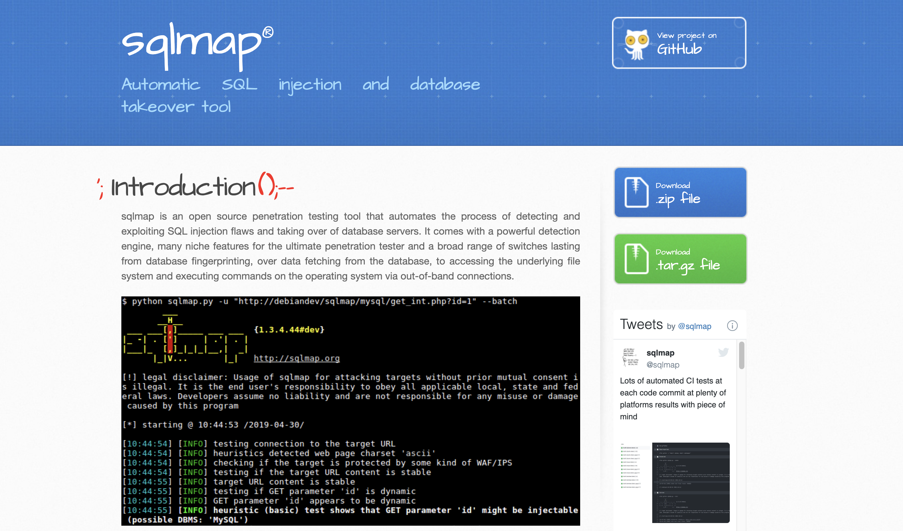

# 3.1 SQLMap 详解  
[sqlmap官网](https://sqlmap.org/)   
[github地址](https://github.com/sqlmapproject/sqlmap)  

sqlmap 是一个开源的渗透测试工具，可以用来自动化的检测，利用SQL注入漏洞，获取数据库服务器的权限。它具有功能强大的检测引擎,针对各种不同类型数据库的渗透测试的功能选项，包括获取数据库中存储的数据，访问操作系统文件甚至可以通过带外数据连接的方式执行操作系统命令。  

- ### 3.1.1 环境搭建  

```shell
# 下载源码  
git clone --depth 1 https://github.com/sqlmapproject/sqlmap.git sqlmap-dev  

# 在根目录运行  
python sqlmap.py -hh  

    -u URL, --url=URL   Target URL (e.g. "http://www.site.com/vuln.php?id=1")
    --batch             Never ask for user input, use the default behavior

Request:
    These options can be used to specify how to connect to the target URL

    --data=DATA         Data string to be sent through POST (e.g. "id=1")
    --cookie=COOKIE     HTTP Cookie header value (e.g. "PHPSESSID=a8d127e..")
    --headers=HEADERS   Extra headers (e.g. "Accept-Language: fr\nETag: 123")
    
# 测试  
python sqlmap.py -u http://10.25.10.82:9999/api/product/list --headers="x-token: eyJhbGciOiJIUzI1NiIsInR5cCI6IkpXVCJ9\nx-user-id: 24" --data="{}"

```  

   

