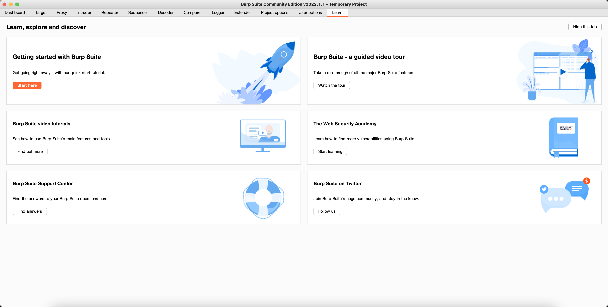

# 3.2 Burp Suite 详解  

## 环境搭建  
Burp Suite是一款集成化的渗透测试工具，包含了很多功能，可以帮助我们高效地完成对web应用程序的渗透测试和攻击。
Burp Suite由Java语言编写，基于Java自身的跨平台性，使这款软件学习和使用起来更方便。
Burp Suite不像其他自动化测试工具，它需要手工配置一些参数，触发一些自动化流程，然后才会开始工作。
Burp Suite可执行程序是Java文件类型的jar文件，免费版可以从官网下载。免费版的Burp Suite会有许多限制，无法使用很多高级工具，如果想使用更多的高级功能，
需要付费购买专业版。专业版与免费版的主要区别有以下三点。
- Burp Scanner
- 工作空间的保存和恢复。
- 拓展工具，如Target Analyer、 Content Discovery 和Task Scheduler。  

Burp Suite是用Java 语言开发的，运行时依赖了JRE，需要安裝ava不境才可以运行。

[下载地址](https://portswigger.net/burp/releases)  

mac版本截图  

  