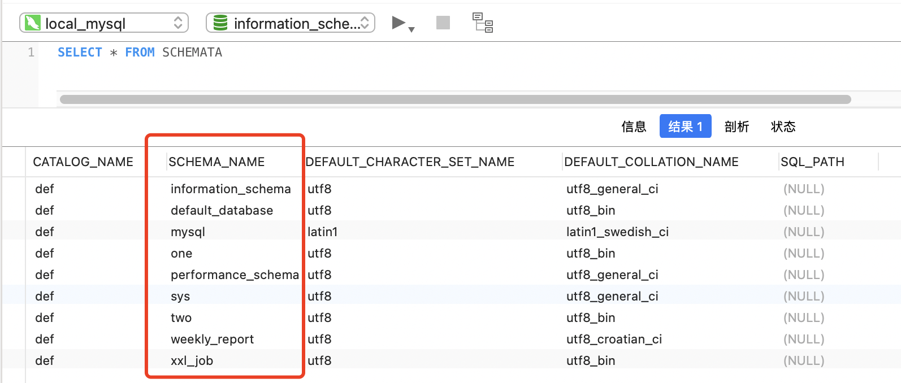
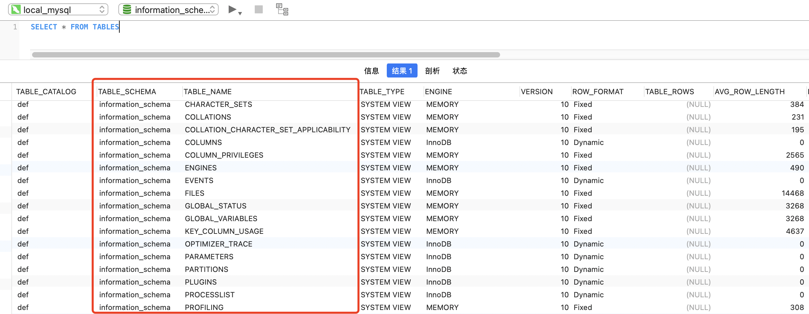
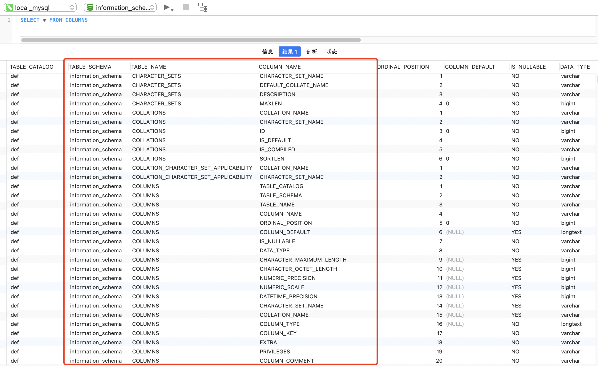

# 4.1 SQL 注入的基础  
[学习资料](../../../code/web安全攻防资料)  

- ## SQL注入简介  

SQL注入就是指web应用程序对用户输入数据的**合法性**没有判断，前端传入后端
的参数是攻击者可控的，并且参数带入数据库查询，攻击者可以通过构造不同的SQL
语句来实现对数据库的任意操作。  

一般情况下，开发人员可以使用动态SQL语句创建通用、灵活的应用。动态SQL
语句是在执行过程中构造的，它根据不同的条件产生不同的SQL语句。当开发人员在
运行过程中需要根据不同的查询标准決定提取什么字段（如select语句），或者根据不
同的条件选择不同的查询表时，动态地构造SOL语句会非常有用。

下面以PHP语句为例。  
```shell
$query = "SELECT * FROM users WHERE id = $_GET['id']"  
```

由于这里的参数ID可控，且带入数据库查询，所以非法用户可以任意拼接SOL语句进行攻击。
当然，SQL注入按照不同的分类方法可以分为很多种，如报错注入、盲注、Union注入等。  

- ## SQL 注入的原理  

SQL注入漏洞的产生需要满足以下两个条件:  
- 参数用户可控：前端传给后端的参数内容是用户可以控制的。  
- 参数带入数据库查询：传入的参数拼接到SQL语句，且带入数据库查询。  


当传入的ID参数为`1'`时，数据库执行的代码如下所示，
```sql
select * from users where id = 1'
```
这不符合数据库语法规范，所以会报错。当传入的ID参数为 `1 and 1=1`时，执行的SOL语句如下所示:  
```sql
select * from users Where id = 1 and 1=1 
```
因为`1=1`为真，且where语句中`id=1`也为真，所以页面会返回与id=1相同的结果。
当传入的ID参数为`and 1=2`时，由于`1=2`不成立，所以返回假，页面就会返回与id=1不同的结果

由此可以初步判断ID参数存在SOL注入漏洞，攻击者可以进一步拼接SQL语句进
行攻击，致使数据库信息泄露，甚至进一步获取服务器权限等在实际环境中，凡是满足上述两个条件的参数皆可能存在SOL注入漏洞，因此开
发者需秉持"外部参数皆不可信的原则"进行开发。  

- ## 与MySQL 注入相关的知识点  
在详细介绍SQL注入漏洞前，先说下MySQL中与SQL注入漏洞相关的知识点。
在MySQL 5.0版本之后，MySQL默认在数据库中存放一个"information_schema"的数据库，
在该库中，读者需要记住三个表名，分别是SCHEMATA、TABLES和COLUMNS.  

SCHEMATA 表存储该用户创建的所有数据库的库名，如图4-1所示。我们需要记
住该表中记录数据库库名的字段名为SCHEMA_NAME  

```sql
SELECT * FROM SCHEMATA
```

<br>
<div align=center>
    </img>  
</div>
<br>

TABLES 表存储该用户创建的所有数据库的库名和表名，如图4-2所示。我们需
要记住该表中记录数据库库名和表名的字段名分别为TABLE_SCHEMA和TABLE_NAME  
```sql
SELECT * FROM TABLES
```
<br>
<div align=center>
    </img>  
</div>
<br>

COLUMNS 表存储该用户创建的所有数据库的库名、表名和字段名，如图4-3所
示。我们需要记住该表中记录数据库库名、表名和字段名的字段名为TABLE_SCHEMA、TABLE_NAME 和COLUMN_NAME
```sql
SELECT * FROM COLUMNS
```
<br>
<div align=center>
    </img>  
</div>
<br>

需要记住的几个函数:  
- database() 当前网站使用的数据库  
- version() 当前MySQL版本  
- user() 当前MySQL用户


- ## Union注入攻击 
[靶场源码](../../../code/web安全攻防资料/第四章/靶场源码/注入/union.php)  


